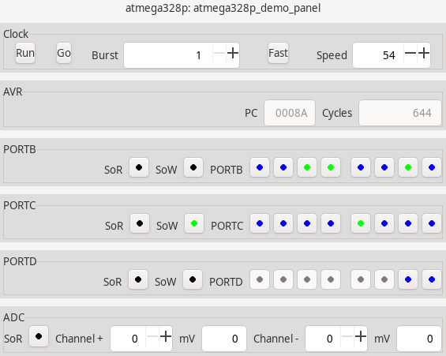
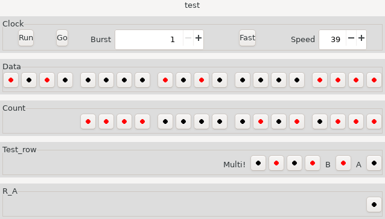

blink - a small library to add a control panel to an electronics simulation.
-----

_blink_ is a small library, based on Gtk, that can be used to add a control
panel to an electronics simulation.  So far it has been used only on Linux,
but as it uses only C, Glib and Gtk libraries, it should be buildable for other environments.

So far it has been used as a front end to the _simavr_ simulator for AVR
microcontrollers

and for some experiments with Icarus Verilog.

The _simavr_ code can be found in the adjacent forked repository, with a brief explanation
<a href="../simavr/doc/Getting_Started.html#panel">here.</a>
The source code is in the file simavr/simavr/sim/panel.c.

Installation
------------
Just run `make` in the lib subdirectory to build the library.
The interface definitions are in the file sim.h.

